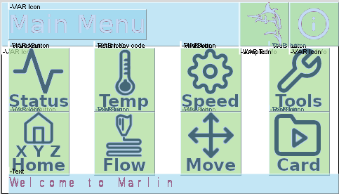
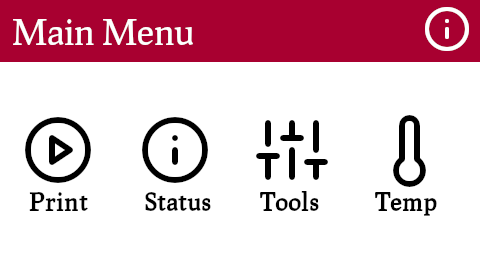

# Display resources for DGUS Displays for Marlin

The project aims on making the `DWIN_SET` for DGUS displays highly configurable so that different UI flavours can be
generated by executing one single script.
This project refines the work done by [coldtobi](https://github.com/coldtobi/Marlin_DGUS_Resources) (kudos -> coldtobi).


## Differences in-between this project and coldtobi's

| This | Coldtobi |
| ---- | -------- |
| material is auto generated and placed into `DWIN_SET/` by running one single command `build.sh`: icons, screen background, audio, DGUS configuation | no scripting |
| build script can create multiple UI flavours of the same project                  | - | 
| icons are used to depict anything, screen background is an empty image  | every screen needs a dedicated image |
| icon placement can be easily modified any time with the DGUS Tool                 | screen background must be modified |
| icons/captions/screen bg./audo/config. can be easily replaced at once             | every single screen background must be modified |
| button effects: audio effect (unfortunately icons lack of visual on-press effect) | button effects: visual effect, every screen needs a 2nd slightly modified screen to overlay the button area when pressed, no audio effect |

# How to Use this Project

## Build and Prepare Disk to Flash Display

1. `$ ./build.sh && ./build.sh --sync <path-to-mounted-compact-flash>`
2. Insert the flash card into the display and turn it on. This will initiate the download to display.
3. When download is finished re-start the display without flash card.

**Synopsis**
```
$ ./build.sh -h 
build.sh [ -h | -f <file.cfg> | -d <file.cfg> | -l | -r | -s ]
   -h, --help                prints this help text
   -f, --flavour <file.cfg>  configuration file name (no path); default: debian-red_dgus-origin_dmt48270c043-06wt.cfg
   -d, --dryrun <file.cfg>   same as -f but without touching anyting
   -l, --list                list configurations
   -r, --remove              cleanup artefacts
   -s, --sync                sync DWIN_SET to removable device and unmount

```

Refer also to READMEs in
* `${DWIN_PROJECT_BASE}/`.
* `${DWIN_PROJECT_BASE}/DWIN_SET/`.

## Notes

* This project is under construction but contributions/clones/forks are encouraged.
* Currently tested only with Creality Ender-5 Plus and Marlin 2.0.x.
* The project relys on minor Marlin [modifications](https://github.com/rubienr/MarlinFirmware/tree/2.0.x-extui-dgus-origin) which are not yet in upstream!
* Maybe here you will find more information: 
  * [\[FR\] Make DGUS_LCD_UI_ORIGIN config. coherent to Configuration*.h #18035](https://github.com/MarlinFirmware/Marlin/issues/18035)
  * [\[FR\] Integrate low cost DWIN Touch panel #12096 ](https://github.com/MarlinFirmware/Marlin/issues/12096)
* Please make sure to only use FOSS compatible resources.
